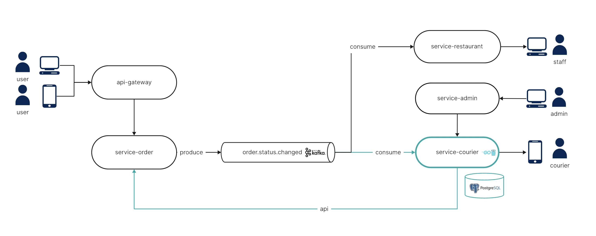

# Домашнее задание для курса "Микросервисы на GO"

## Сервис доставки еды из ресторана
Вы — backend-разработчик в компании, которая занимается доставкой еды из ресторанов. Компания активно развивается, ежедневно обрабатываются тысячи заказов, и архитектура проекта построена на микросервисах — каждый сервис отвечает за свой участок бизнес-логики.
Вам предстоит работать над одним из ключевых компонентов — сервисом управления курьерами (service-courier). Именно этот сервис отвечает за взаимодействие с курьерами: от добавления новых сотрудников до автоматического распределения заказов.

Вот как выглядит упрощённая схема взаимодействия микросервисов:

**Задача**
На данном этапе ваша цель — спроектировать и реализовать сервис service-courier, который инкапсулирует в себе всю логику, связанную с курьерами.

Что должен уметь этот сервис:
1. **Управление курьерами**: менеджеры могут добавлять, редактировать и удалять курьеров через админ-панель.
2. **Назначение курьера на заказ**: при создании заказа система должна автоматически назначить свободного курьера.
3. **Освобождение курьера**: при отмене или завершении заказа курьер должен становиться свободным.
4. **Контроль активности**: если курьер забрал заказ, но не перешёл в статус "свободен" после доставки — он автоматически переводится в статус "на паузе" до выяснения обстоятельств.

Создание такого сервиса — задача не из простых. Поэтому мы будем двигаться поэтапно, шаг за шагом декомпозируя функциональность и реализуя её в логической последовательности.

1. [Создание boilerplate сервиса, поднятие веб сервера](task1.md)
2. [Подключение базы данных и добавление crud API](task2.md)
3. [Архитектура, внедрение зависимостей и интерфейсы](task3.md)
4. [Назначение и снятие курьера с заказа](task4.md)
5. [Автоматическое освобождение курьеров и равномерное распределение заказов](task5.md)
6. [Покрытие проекта тестами](task6.md)
7. [Синхронная интеграция: Назначение курьеров на заказы](task7.md)
8. [Асинхронная интеграция: Назначение курьеров по событиям](task8.md)
9. [Метрики, мониторинг и логирование](task9.md)
10. [Rate Limiter и Retry при обращении к внешнему сервису](task10.md)
11. [Линтинг, проверка стиля и CI-пайплайн](task11.md)
12. [Профилирование приложения с помощью pprof](task12.md)